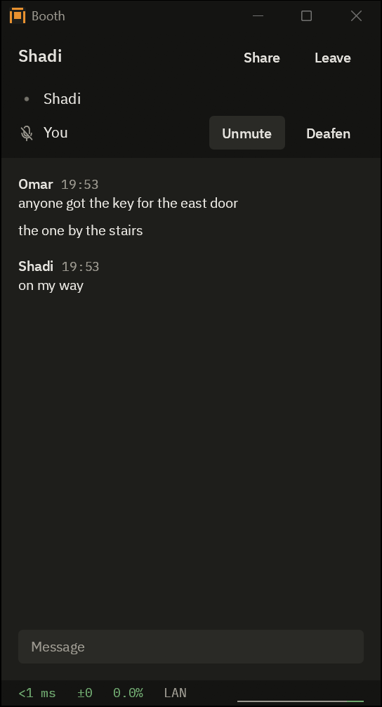
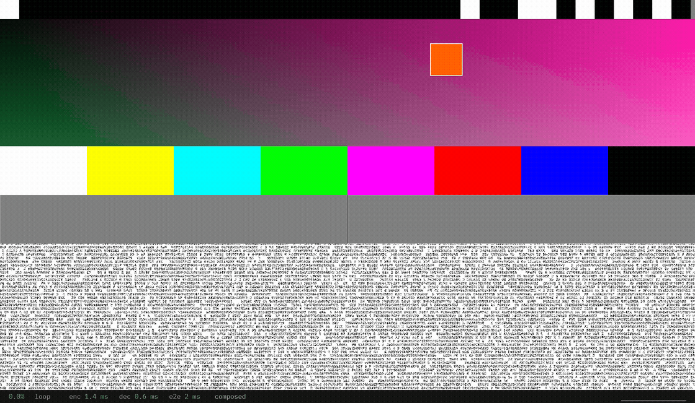

# Booth

Voice, text chat and screen sharing for a few friends on Windows, built for the lowest delay.





## About

One friend hosts on their own PC, the others join with an invite code, and packets go straight between each friend's PC and the host's, encrypted. No accounts, no cloud, no server in the middle.

## Features

- Voice in 5 ms Opus frames, with a jitter buffer that starts at the minimum.
- Screen sharing with Desktop Duplication and GPU encoding, up to 1440p at 120 fps, H.264 or HEVC. On Intel graphics it encodes in software for now, H.264 up to 1080p at 60 fps.
- On my PCs, capture to display (median): about 5 ms at 1440p120 with host and viewer on one PC, 22 to 32 ms over the internet to my laptop on Wi-Fi. Voice playback alone: 20 ms.
- Voice, video and chat over UDP, never in plain text, not even on a LAN.
- Ping, jitter and loss always on screen in a room.
- Push to talk and other hotkeys work with a game in focus, unless the game runs as administrator.

## Download

Run the setup, [booth-0.2.2-setup.exe](https://github.com/Shadi-Alrashoodi/booth/releases/download/v0.2.2/booth-0.2.2-setup.exe), or unzip [booth-0.2.2-windows-x64.zip](https://github.com/Shadi-Alrashoodi/booth/releases/download/v0.2.2/booth-0.2.2-windows-x64.zip) and run booth.exe. Older versions are on the [releases page](https://github.com/Shadi-Alrashoodi/booth/releases). It needs Windows 10 version 2004 or later, or Windows 11, 64-bit, with a DirectX 12 graphics driver.

- SmartScreen says "Windows protected your PC" because the exe is not code signed yet: More info, then Run anyway.
- With Smart App Control on, Windows 11 blocks Booth outright, with no Run anyway, until the exe is signed.
- Booth asks once for administrator rights for its firewall rule: Allow, then Yes.
- Use a wired or USB headset: Booth has no echo cancellation.

## Using it

Press Host, then Copy, and send the invite to your friends. It lets in one friend within 10 minutes; for a group, switch it to anyone, 24 h, and copy it again. It carries your internet address, so never post it in public. Each friend runs Booth, pastes the invite under Join a room, and rejoins later from Known hosts. If a friend cannot get in, Booth gives them a code for the host to paste under the invite; failing that, forward UDP 41000 to the host's PC, or use Tailscale or WireGuard.

Hotkeys, set in Settings, with push to talk on by default: Right Ctrl push to talk; Ctrl+Shift+M mute; Ctrl+Shift+D deafen; Ctrl+Shift+S twice within a second to share, once to stop; Ctrl+Shift+Space show or hide Booth; Ctrl+Shift+I the stats panel.

## Building

You need Windows 11, rustup, the Visual Studio 2022 Build Tools with C++ x64 tools and CMake, and PowerShell.

```
powershell -ExecutionPolicy Bypass -File tools\fetch-third-party.ps1
cargo build --release --locked -p app
```

`cargo test --workspace --locked` runs the tests.

## Security

In a Noise handshake (Noise_IKpsk2_25519_ChaChaPoly_BLAKE2s) both sides prove who they are; every later packet is encrypted. No crypto of my own: the snow, dalek and RustCrypto crates. The host decrypts and forwards everything in the room, so only join a host you trust. The handshake and session code has not had an outside audit yet. Booth asks two public STUN servers, Cloudflare's and Google's unless changed in Settings, for its outside address; they see that and nothing else.

## License

Booth is licensed under MIT or Apache-2.0, at your option: [LICENSE-MIT](LICENSE-MIT) and [LICENSE-APACHE](LICENSE-APACHE).

- The two FFmpeg DLLs, avcodec-62.dll and avutil-60.dll, are FFmpeg 8.1.3 built from its unmodified source with only the H.264 and HEVC decoders and their Direct3D 11 paths, under the LGPL version 2.1 or later. Booth loads them at runtime from next to booth.exe, so you can swap in your own build. The exact source archive and the recipe that built them, `ffmpeg-8.1.3.tar.xz` and `ffmpeg-8.1.3-recipe.zip`, are in their own release at https://github.com/Shadi-Alrashoodi/booth/releases/tag/ffmpeg-8.1.3. The source archive is also at https://ffmpeg.org/releases/ffmpeg-8.1.3.tar.xz. The `ffmpeg` folder in the zip has the LGPL 2.1 text, `NOTICES.txt` with the notices of the few files in the DLLs under a permissive license of their own, and `SOURCE.txt` with their configure line and the hashes of the DLLs and the source. The DLLs are based in part on the work of the Independent JPEG Group.
- IBM Plex Sans, Sans Arabic and Mono are under the SIL Open Font License 1.1. The text is `assets\fonts\OFL.txt` in the source and in THIRD-PARTY-LICENSES.txt.
- The Phosphor icon font, from the egui-phosphor crate, is under the MIT license.
- `vendor\epaint` and `vendor\egui` are epaint and egui 0.36.2 with right-to-left fixes, MIT or Apache-2.0; `PATCHED.txt` in each says what changed.
- THIRD-PARTY-LICENSES.txt in the zip lists every Rust crate in booth.exe with its license, NVIDIA's notice for the encoder declarations copied into `crates\encode`, the fonts and FFmpeg. Twelve of those crates ship no license text of their own; the list gives each the standard text of its license, marked as such.
