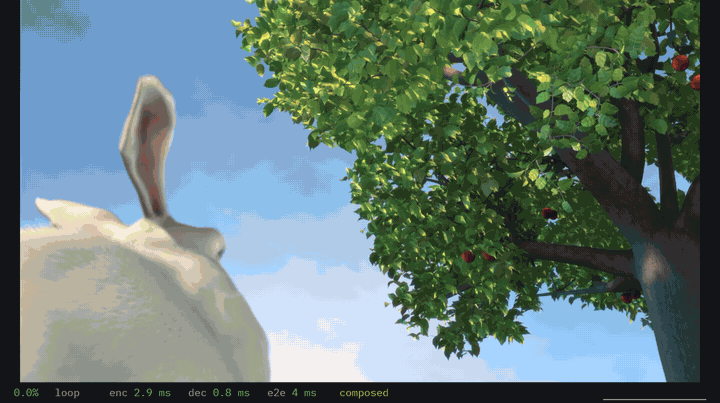

# Booth

Voice, text chat and screen sharing for a few friends on Windows, built for the lowest delay.




## Download

[booth-0.2.3-setup.exe](https://github.com/Shadi-Alrashoodi/booth/releases/download/v0.2.3/booth-0.2.3-setup.exe), the installer

[booth-0.2.3-windows-x64.zip](https://github.com/Shadi-Alrashoodi/booth/releases/download/v0.2.3/booth-0.2.3-windows-x64.zip), to unzip anywhere and run booth.exe

Windows 10 version 2004 or later, or Windows 11, 64-bit, with a DirectX 12 graphics driver. Older versions are on the [releases page](https://github.com/Shadi-Alrashoodi/booth/releases).

The exe is not code signed yet, so SmartScreen warns once (More info, then Run anyway), and Smart App Control on Windows 11 blocks it.

## Using it

Press Host, then Copy, and send the invite to your friends. They paste it under Join a room, and later rejoin from Known hosts. An invite lets in one friend within 10 minutes; for a group, switch it to anyone, 24 h, and copy it again. It carries your internet address, so never post it in public.

If a friend cannot get in, Booth gives them a code for the host to paste under the invite. Failing that, forward UDP 41000 to the host's PC, or use Tailscale or WireGuard.

The first time, Booth asks for administrator rights to add its firewall rule. Use a wired or USB headset: Booth has no echo cancellation.

Push to talk is on by default: hold Right Ctrl to talk. Hotkeys work while a game has focus, unless the game runs as administrator. See and change them in Settings.

## Features

- Voice in 5 ms Opus frames, with a jitter buffer that starts at the minimum.
- Screen sharing with Desktop Duplication and GPU encoding, H.264 or HEVC, up to 1440p at 120 fps. On Intel graphics Booth encodes in software for now, H.264 up to 1080p at 60 fps.
- Median capture to display on my PCs: about 5 ms at 1440p120 with host and viewer on one PC, 22 to 32 ms over the internet to a laptop on Wi-Fi.
- Ping, jitter and loss always on screen in a room.

## Building

You need Windows 11, rustup, the Visual Studio 2022 Build Tools with C++ x64 tools and CMake, and PowerShell.

```
powershell -ExecutionPolicy Bypass -File tools\fetch-third-party.ps1
cargo build --release --locked -p app
```

`cargo test --workspace --locked` runs the tests.

## Security

Booth has no accounts and no cloud: voice, video and chat go straight between each friend's PC and the host's, over UDP, encrypted even on a LAN. Each connection starts with a Noise handshake (Noise_IKpsk2_25519_ChaChaPoly_BLAKE2s) in which both sides prove who they are. The crypto is the snow, dalek and RustCrypto crates, not my own; the code around it has had no outside audit. The host decrypts and forwards everything in the room, so only join a host you trust. To learn your outside address, Booth asks two public STUN servers, Cloudflare's and Google's unless you change them in Settings; they see that address and nothing else.

## License

MIT or Apache-2.0, at your option: [LICENSE-MIT](LICENSE-MIT), [LICENSE-APACHE](LICENSE-APACHE).

- avcodec-62.dll and avutil-60.dll are FFmpeg 8.1.3 with only the H.264 and HEVC decoders and their Direct3D 11 paths, under the LGPL 2.1 or later. Booth loads them at runtime from next to booth.exe, so you can swap in your own build. The unmodified source and the build recipe are in the [ffmpeg-8.1.3 release](https://github.com/Shadi-Alrashoodi/booth/releases/tag/ffmpeg-8.1.3), and the zip's ffmpeg folder has the LGPL text, the other notices and the build details. The DLLs are based in part on the work of the Independent JPEG Group.
- The IBM Plex fonts: SIL Open Font License 1.1, in `assets\fonts\OFL.txt`. The Phosphor icon font, from egui-phosphor: MIT.
- `vendor\egui` and `vendor\epaint` are egui and epaint 0.36.2 with right-to-left fixes, MIT or Apache-2.0; `PATCHED.txt` in each says what changed.
- THIRD-PARTY-LICENSES.txt in the zip lists every Rust crate in booth.exe with its license, and NVIDIA's notice for the encoder declarations in `crates\encode`.
- The film in docs/share.gif is Big Buck Bunny, (c) copyright 2008, Blender Foundation, www.bigbuckbunny.org, under CC BY 3.0.
