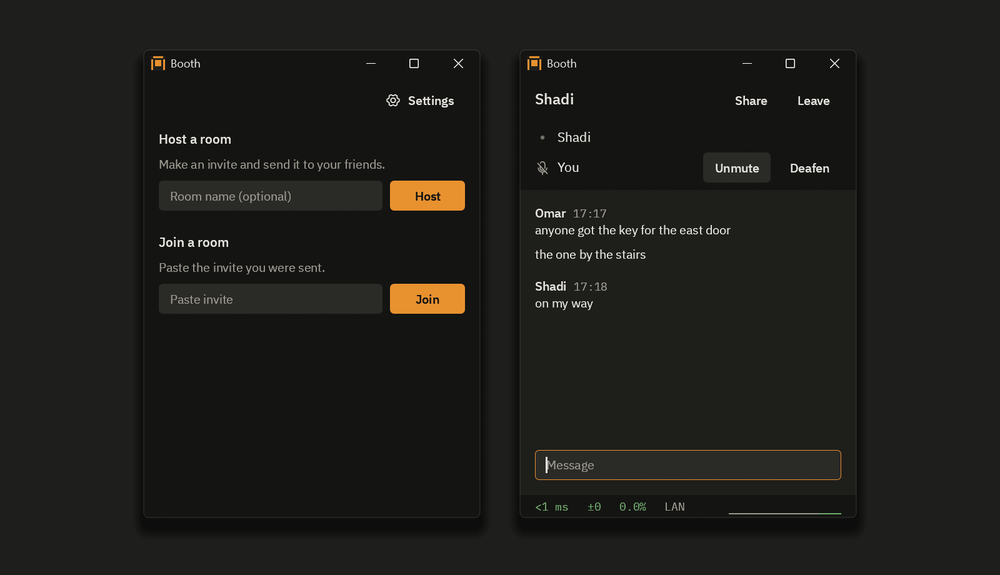

<p align="center"></p>

<h1 align="center">Booth</h1>

<p align="center">Voice, text chat and screen sharing for a few friends on Windows, built for the lowest delay.</p>

<p align="center"><a href="https://github.com/Shadi-Alrashoodi/booth/releases/download/v1.0.0/booth-1.0.0-setup.exe"><b>Download the installer</b></a> &nbsp; or &nbsp; <a href="https://github.com/Shadi-Alrashoodi/booth/releases/download/v1.0.0/booth-1.0.0-windows-x64.zip">the zip</a></p>

<p align="center"><a href="https://github.com/Shadi-Alrashoodi/booth/releases/latest"></a> <a href="#license"></a></p>



## Download

Run the installer, or unzip the zip anywhere and run booth.exe. It needs Windows 10 version 2004 or later, or Windows 11, 64-bit, with a DirectX 12 graphics driver.

The exe is not code signed yet, so SmartScreen warns once (More info, then Run anyway), and Smart App Control on Windows 11 blocks it. The [release page](https://github.com/Shadi-Alrashoodi/booth/releases/latest) has latest.txt, signed with minisign, with the SHA-256 of both files and the steps to check them.

## Using it

Press Host, then Copy, and send the invite to a friend. They paste it under Join a room, and later rejoin from Known hosts. An invite lets in one friend within 10 minutes; for a group, press single use, 10 min so it reads anyone, 24 h, and copy the new invite. Either one carries your internet address, so never post it in public.

If a friend cannot get in, Booth gives them a code for the host to paste under the invite. Failing that, forward UDP 41000 to the host's PC, or use Tailscale or WireGuard.

The first time, Booth asks for administrator rights to add its firewall rule. Use a wired or USB headset: Booth has no echo cancellation.

Push to talk is on by default: hold Right Ctrl to talk. Hotkeys work while a game has focus, unless the game runs as administrator. See and change them in Settings.

## Features

- Voice in 5 ms Opus frames, with a jitter buffer that starts as small as it can and grows only when the network needs it.
- Screen sharing with Desktop Duplication and GPU encoding, H.264 or HEVC, up to 1440p at 120 fps. On Intel graphics Booth encodes in software for now, H.264 up to 1080p at 60 fps.
- Median capture to display on my PCs: about 5 ms at 1440p120 with host and viewer on one PC, 22 to 32 ms over the internet to a laptop on Wi-Fi.
- Ping, jitter and loss always on screen in a room.

## Building

You need Windows 11 (the FFmpeg build needs it), rustup, and the Visual Studio 2022 Build Tools with C++ x64 tools and CMake. The first command builds the two FFmpeg DLLs from source, a few minutes the first time; the second makes target\release\booth.exe.

```
powershell -ExecutionPolicy Bypass -File tools\fetch-third-party.ps1
cargo build --release --locked -p app
```

`cargo test --workspace --locked` runs the tests.

## Security

Booth has no accounts and no cloud: voice, video and chat go straight between each friend's PC and the host's, over UDP, encrypted even on a LAN. Each connection starts with a Noise handshake (Noise_IKpsk2_25519_ChaChaPoly_BLAKE2s) in which both sides prove who they are. The crypto is the snow, dalek and RustCrypto crates, not my own; the code around it has had no outside audit. The host decrypts and forwards everything in the room, so only join a host you trust. To learn your outside address, Booth asks two public STUN servers, Cloudflare's and Google's unless you change them in Settings; they see that address and nothing else. Besides those, Booth contacts only github.com, and only if you turn on Check for new versions in Settings. Report a security problem privately from the Security tab on GitHub.

## License

MIT or Apache-2.0, at your option: [LICENSE-MIT](LICENSE-MIT), [LICENSE-APACHE](LICENSE-APACHE).

- avcodec-62.dll and avutil-60.dll are FFmpeg 8.1.3 with only the H.264 and HEVC decoders and their Direct3D 11 paths, under the LGPL 2.1 or later. Booth loads them at runtime from next to booth.exe, so you can swap in your own build. The unmodified source and the build recipe are in the [ffmpeg-8.1.3 release](https://github.com/Shadi-Alrashoodi/booth/releases/tag/ffmpeg-8.1.3), and the zip's ffmpeg folder has the LGPL text, the other notices and the build details. The DLLs are based in part on the work of the Independent JPEG Group.
- The IBM Plex fonts: SIL Open Font License 1.1, in `assets\fonts\OFL.txt`. The Phosphor icon font, from egui-phosphor: MIT.
- `vendor\egui` and `vendor\epaint` are egui and epaint 0.36.2 with right-to-left fixes, MIT or Apache-2.0; `PATCHED.txt` in each says what changed.
- THIRD-PARTY-LICENSES.txt in the zip lists every Rust crate in booth.exe with its license, and NVIDIA's notice for the encoder declarations in `crates\encode`.
